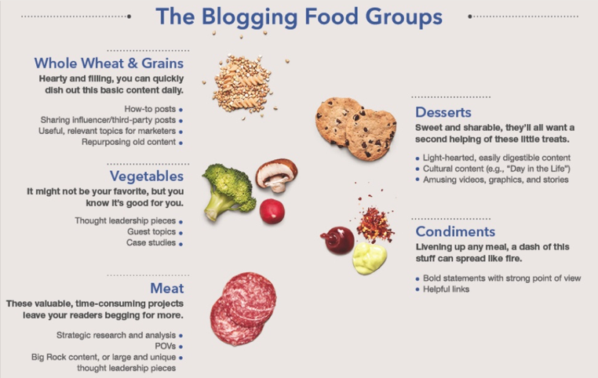

# Account form

We discussed what to ask to a customer who subscribes to a content.supply account. From these questions an editorial brief or formula should be generated. With the answers of these questions we should be able to make worthy pitches.

## General take-aways

The form shouldn't be boring. The tone of voice can be a bit humor-like and informal, not to much though, but it should be fun to fill out. Favorable answers: yes/no questions, multiple choice and always an 'other' option. Flow-chart like.

## Inspiration: see diversity in blog posts as food groups

<a href="http://www.socialfresh.com/content/uploads/2014/02/well-balanced-blog.jpg">                  
## Questions and goals

> What floats your boat?

1. What do you want to achieve?
2. Who do you want to reach?
3. How do you want to achieve your goal?

### Form ideas:
  * Outcomes can be tick boxes [x].
  * Flow charts with follow-up questions (yes/no).
  * Likert scales (strongly disagree, disagree, neutral, agree, strongly agree).
  * Ranking 1-5/1-10

### What do you want to achieve with your blog? (possible outcome)

* Increase current audience
  * By website traffic
  * By Facebook followers
  * By Twitter followers
  * By LinkedIn connections

* Increase conversion
  * You always want readers to share your posts
  * It's important that readers can comment on your post

* Increase website traffic
* Give company insights
  * World view
  * Get to know your employees
  * Show how you work

* Show your clients/customers to the world
* Show why your organisation is great to work with
* Change perception of brand
* Show your organisation is an integral part of society
* Increase exposure
* Show and explain your expertise
* Show you're different from competition
* You're creating something new
* Add value to society/help people
* Elicit emotions

* Is there an images/text ratio that we must take into account?
  * Scale 1-5 image / 1-5 text (slider)
  * Text more important than images
  * Images more important than text   

* How do you want the reader to perceive the sender? (slider? How many 'jokes'?)
* Playful
* Funny
* Serious
* Professional

### Who do you want to reach with your blog?

* Current customers
* Different customers
* Current clients (same niche)
* Different clients
* Current and different
* Colleagues
* Digitally native / or not (slider?)
* Language
  * English
  * Dutch
  * English and Dutch (your price goes up with 50%)
* Level of intellect (slider with )
* Amount of time people have (busy or not busy readers)

### How do you want to achieve your goal?

### Extra

* Are there company style guidelines that we have to take into account?
