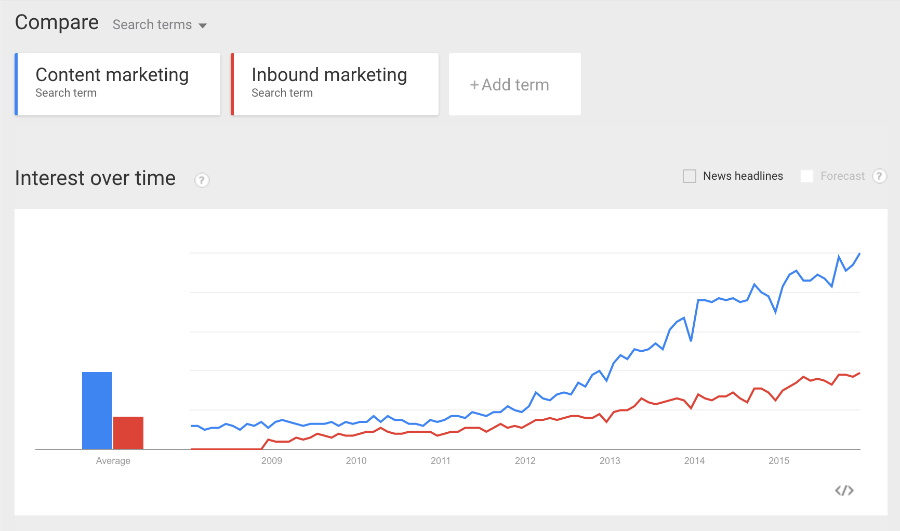
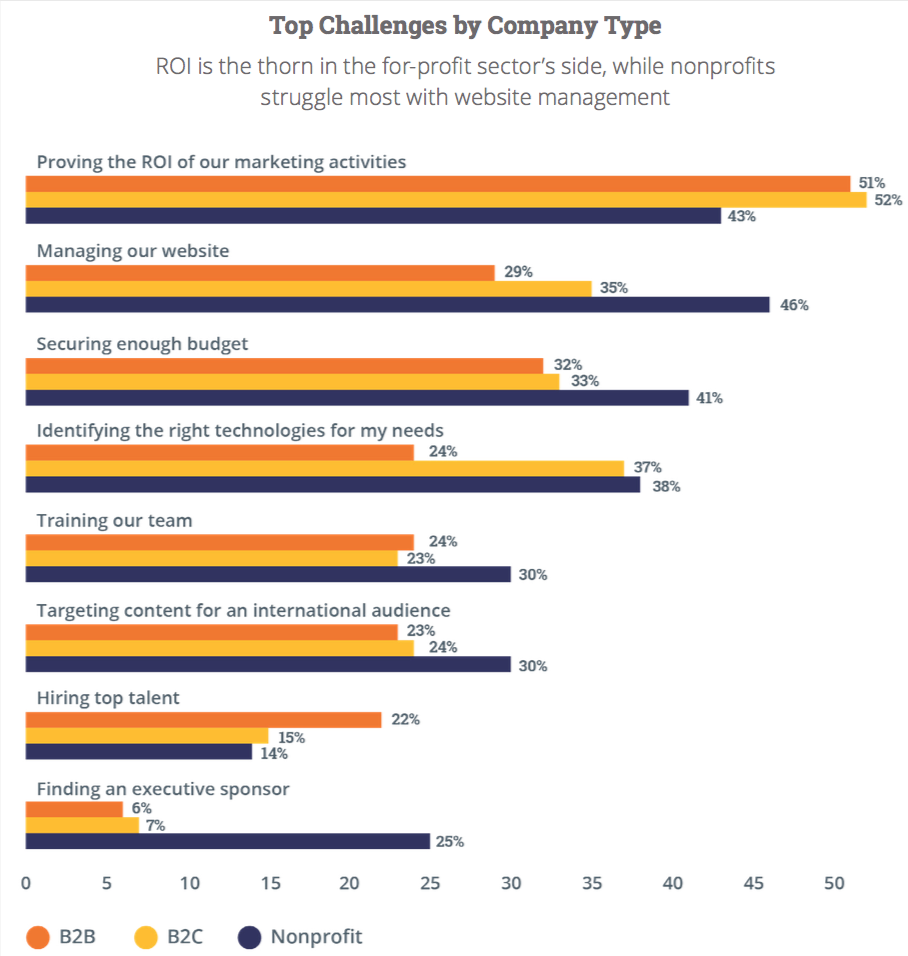
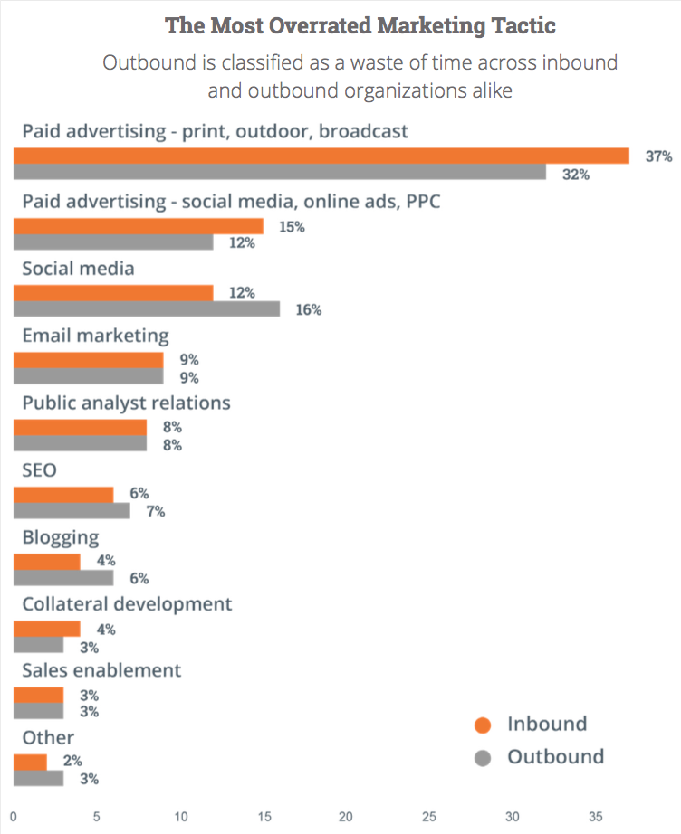
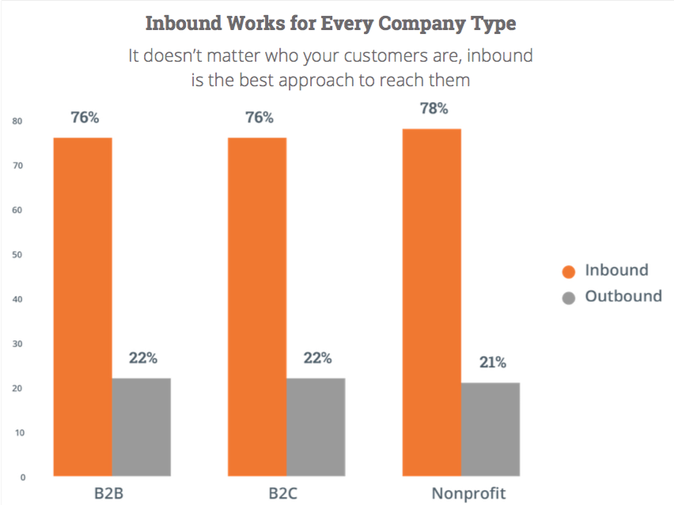

# English market research
This document is an attempt to get to know the content creation market. Google trends will be shown and most important insights of survey's are given. All this, to show the potential of content.supply to investors and/or prospects. They can see how large the market is in the UK, US and the rest of the English speaking world. 

## Google trends inbound and Content marketing 
_Click on image for full analysis:_

Embedded link:
	
	

## The State of Inbound Survey 2015
_Inbound_ marketing prioritizes compelling content over ads, and pulling customers to you rather than pushing your message onto them.  

By creating content specifically designed to appeal to your dream customers, inbound attracts qualified prospects to your business and keeps them coming back for more. [What is inboud marketing?](http://www.hubspot.com/inbound-marketing)

_Outbound_ marketing: commercials, flyers, advertisements, cold calls, email blasts. Mostly used by large companies. 

[_The State of Inbound 2015_](inbound-report-2015.pdf) is a survey from hubspot, a renowned inbound marketing and sales platform. The majority of their nearly **4,000 respondents** are marketers and sales people who work for B2B and SMB's (small and medium size business)in more than 150 countries. One-third have an affiliation with [HubSpot](http://www.hubspot.com/).  
  
### Growth of inbound

* **3/4** marketers prioritize an inbound approach to marketing.

  

Notable to see that the top challenge for Non-profits in _managing their own website_ is a high **46%**. A problem that content.supply can tackle through creating, posting content and posting on social media platforms. 

### Emerging trends

So, striking: even respondents (**32%**) whose companies identify as primarily outbound organisations called paid advertisement the most overrated marketing. 

Marketing content creation no longer limited to in-house writers. Data shows an increase in the number of respondents who indicated they use freelancers and agency partners of content creation.

